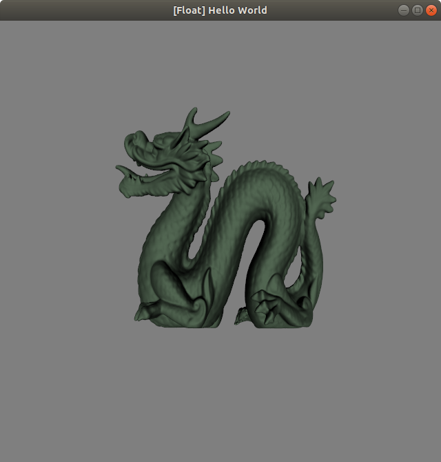

# Assignment 5

By Justin Chen (jc8017)

*Note* When changing modes, current object will deselect. Click on object again to change 

# Ex 1

## Adding Meshes

Press keys 1,2,3,4 to add a cube, bumpy cube, bunny, or dragon

Cube

Bumpy_cube

Bunny 

Dragon

Multiple Objects

## Translate 

Click on a mesh to select it, then click on mesh and drag to move the mesh.

## Rotate

Click on a mesh to select it. Then press R and E to rotate it around the z axis

## Scale

Click on a mesh to select it. Then press A and S to scale it up and down.

## Delete

Click on a mesh to select it. Then press D to delete the mesh from scene.

# Ex 2

Press M to change modes. The default is wireframe. The second mode is phong shading, and the final is flat shading.

# Ex 3

Select any mesh by clicking on it. Then click keys 7,8,9,0 to change the color. Key 7 is the default color.

# Ex 4

Implemented all of the transitions, rotations, scaling in shader method. Each mesh should have a model matrix that tracks all of the transformations. When rotating, translating or scaling, the transformations are all stored in that model matrix. Rotations and scaling are also done without changing the barycenter of the mesh. The mesh is translated to center, then either rotated or scaled and then translated back. 

